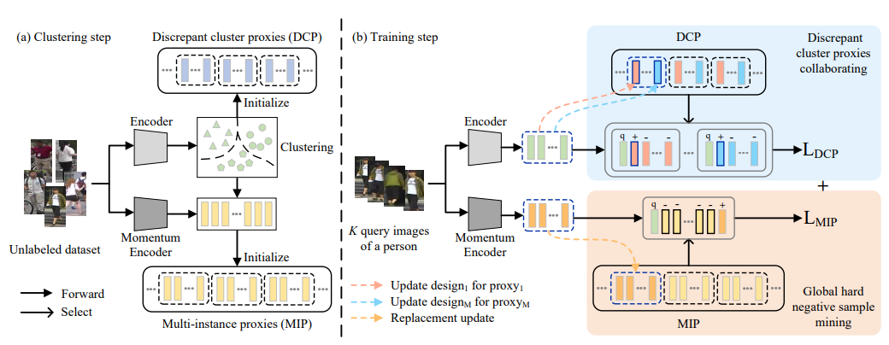

# [NOT Official] Discrepant and Multi-instance Proxies for Unsupervised Person Re-identification (ICCV2023)

[[paper]](https://openaccess.thecvf.com/content/ICCV2023/papers/Zou_Discrepant_and_Multi-Instance_Proxies_for_Unsupervised_Person_Re-Identification_ICCV_2023_paper.pdf)

## Upload History

* 2025/08/14: Unsupervised Code.

## Installation

Install `conda` before installing any requirements.

```bash
conda create -n dcmip python=3.9
conda activate dcmip
pip install -r requirements.txt
```
## Overview



## Datasets

Make a new folder named `data` under the root directory. Download the datasets and unzip them into `data` folder.
* [Market1501](https://drive.google.com/file/d/0B8-rUzbwVRk0c054eEozWG9COHM/view)
* [MSMT17](https://arxiv.org/abs/1711.08565)

## Training

For example, training the full model on Market1501 with GPU 0 and saving the log file and checkpoints to `logs/market-pclclip`:

```
CUDA_VISIBLE_DEVICES=0,1,2,3 python train.py -b 256 -d market1501 --iters 100 --eps 0.45 --epochs_stage1 40 --epochs_stage2 50 --logs-dir ./log/market1501

CUDA_VISIBLE_DEVICES=0,1,2,3 python train.py -b 256 -d msmt17 --iters 100 --eps 0.7 --epochs_stage1 40 --epochs_stage2 50 --logs-dir ./log/msmt
```

## Results

The results are on Market1501 (M) and MSMT17 (MS).

| Methods | M | Link | MS | Link |
| --- | -- | -- | -- | - |
| CC + DCMIP | 86.7 (94.7) | - | 40.9 (69.3) | - |
| CC + DCMIP (Reproduce) |  86.7(94.5) | - |  40.7(69.4) | - |

## Note
The model training requires 4 GPUs.

The code is implemented based on following works.

1. [PCLHD](https://github.com/RikoLi/PCL-CLIP)
2. [NCPLR](https://github.com/haichuntai/NCPLR-ReID)
3. [ClusterContrast](https://github.com/alibaba/cluster-contrast-reid)


